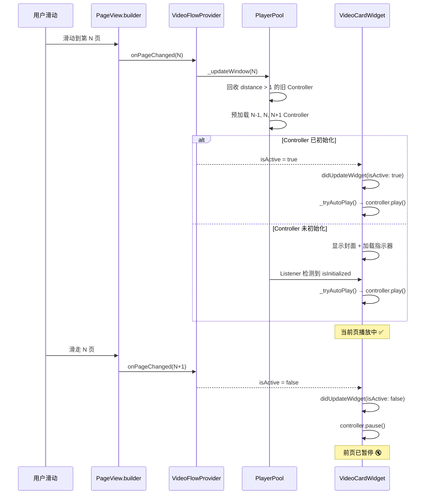
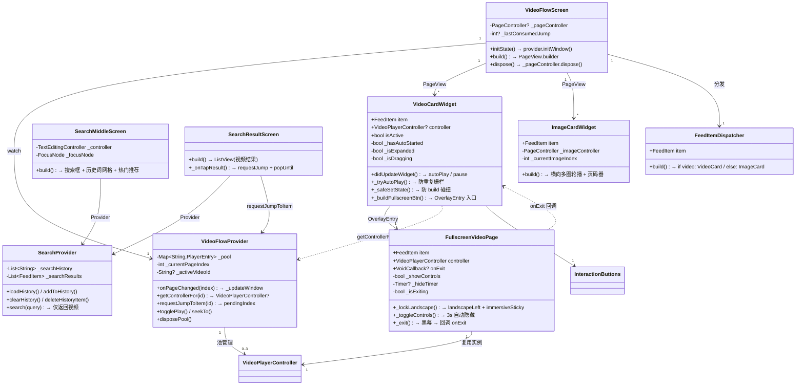

# Toutiao Demo — 仿今日头条视频流与搜索联动 Flutter 项目

[](https://flutter.dev)
[](https://dart.dev)

一个 Flutter 短视频信息流项目，还原类抖音全屏滑动视频播放体验，并实现**无黑屏无抖动的 Overlay 全屏切换**架构。

---

## 目录

- [1. 技术栈](#1-技术栈)
- [2. 项目结构](#2-项目结构)
- [3. 核心技术实现](#3-核心技术实现)
  - [3.1 类抖音视频流播控机制](#31-类抖音视频流播控机制)
  - [3.2 跨页面状态幂等同步与无感全屏](#32-跨页面状态幂等同步与无感全屏)
  - [3.3 全屏沉浸式 UI 与等比例缩放适配](#33-全屏沉浸式-ui-与等比例缩放适配)
  - [3.4 播放器实例复用池](#34-播放器实例复用池-player-pool-pattern)
  - [3.5 AI 与搜索模块](#35-ai-与搜索模块)
- [4. 关键流程图](#4-关键流程图)
- [5. UML 类图](#5-uml-类图)
- [6. 快速开始](#6-快速开始)
- [7. 性能日志](#7-性能日志)

---

## 1. 技术栈

| 层级 | 技术 | 说明 |
|---|---|---|
| 框架 | **Flutter 3.44** (Dart 3.12) | 全链路 100% Flutter 开发 |
| 状态管理 | **Provider** | 声明式 MVVM 架构 |
| 视频渲染 | `video_player` + `chewie` | 底层解码 + 手势播控面板 |
| 本地存储 | `shared_preferences` | 搜索历史持久化 |
| 数据模型 | `FeedItem` (MVVM Model) | 视频/图文混合流统一模型 |
| 设计模式 | **MVVM** | View - ViewModel - Model 严格分层 |

---

## 2. 项目结构

```
lib/
├── data/
│   ├── models/
│   │   └── feed_item.dart              # 混合流数据模型 (FeedType枚举/多图/推荐词)
│   └── datasource/
│       └── mock_data_center.dart       # 20条假数据 + 模糊检索
├── providers/
│   ├── video_flow_provider.dart        # 视频流状态 + 播放器复用池 (Pool Pattern)
│   └── search_provider.dart            # 搜索历史/检索/过滤
├── views/
│   ├── screens/
│   │   ├── video_flow_screen.dart       # 首页: 全屏垂直滑动 PageView
│   │   ├── search_middle_screen.dart    # 搜索中间页: 键盘+历史词网格
│   │   ├── search_result_screen.dart    # 搜索结果页: 视频列表→反哺回跳
│   │   └── fullscreen_video_page.dart   # 横屏全屏悬浮页 (OverlayEntry)
│   └── widgets/
│       ├── feed_item_dispatcher.dart    # 视频/图文模板分发器
│       ├── video_card_widget.dart       # 视频卡片: 播控UI + 展开文案 + 进度条
│       ├── image_card_widget.dart       # 图文卡片: 横向多图轮播 + 页码器
│       ├── interaction_buttons.dart     # 右侧互动挂件 (头像/点赞/评论/分享)
│       └── search_bar_header.dart       # 顶部搜索入口 (放大镜图标)
└── main.dart                            # MultiProvider + 命名路由
```

---

## 3. 核心技术实现

### 3.1 类抖音视频流播控机制

利用 `PageView.builder` 的生命周期回调 + Provider 状态管理实现精准播控。

**关键生命周期**:

```
用户翻页 → onPageChanged(N)
  │
  ├─ VideoFlowProvider._updateWindow(N)  ← 滑动窗口算法
  │   ├─ 回收: distance(N, old_item) > 1 → controller.dispose()
  │   ├─ 预加载: distance(N, new_item) ≤ 1 → controller.initialize()
  │   └─ 更新 _activeVideoId
  │
  └─ VideoCardWidget.didUpdateWidget(isActive: true)
      ├─ _tryAutoPlay() → _ctrl.play()     ← 翻页即播
      └─ _hasAutoStarted = true            ← 防重复调用栅栏

用户滑走 → didUpdateWidget(isActive: false)
  └─ _ctrl.pause()                         ← 前页即停 (防串音)
```

**核心栅栏代码**:

```dart
void _tryAutoPlay() {
  if (!_hasAutoStarted && _isInitialized && widget.isActive) {
    _hasAutoStarted = true;
    widget.controller!.play();  // 仅首次自动触发，后续忽略
  }
}
```

**防串音三层保障**: Provider 层 `assert(id == _activeVideoId)` + Widget 层 `pause()` + Listener 层 `_safeSetState()`。

---

### 3.2 跨页面状态幂等同步与无感全屏

传统 `Navigator.push` 全屏方案有三大致命缺陷：

| 问题 | 根因 |
|---|---|
| **黑屏抖动** | 路由出栈时竖屏页在横屏尺寸下 rebuild |
| **视频重载** | 新页面创建新 Controller → `initialize()` 重新拉流 |
| **setState 崩溃** | 全屏 `initState` 中 `play()` 同步触发竖屏页 listener → `setState() called during build` |

**解决方案: Top-level Overlay 架构**

抛弃 `Navigator.push`，改用 **`OverlayEntry` 悬浮贴纸** 方案：

```
竖屏页持续渲染 ← 控制器保持活跃 ← 零重载
     │
     ├── Overlay.of(context).insert(_fullscreenEntry!)
     │       │
     │       └── Material(transparent)
     │             └── FullscreenVideoPage(controller: _ctrl)  ← 复用同一实例
     │
     ├── 退出: setPreferredOrientations(portraitUp) → await 200ms
     │         → entry.remove()  ← 转屏在贴纸下"闷烧"完毕，撕掉瞬间无黑屏
     │
     └── _safeSetState(): 检测 SchedulerPhase，build 阶段推迟到 postFrame
```

**对比**:

| 维度 | Navigator 路由 | OverlayEntry 贴纸 |
|---|---|---|
| 页面间 Controller | 创建新实例，需重新 `initialize()` | **复用同一实例**，零延迟续播 |
| 转屏时序 | pop 后旋转 → 竖屏页在横屏尺寸渲染 → 抖动 | 旋转 → 等 200ms → remove → 竖屏页早已竖屏 |
| setState 碰撞 | 同步 `play()` 触发多 Widget 交叉刷新 | `_safeSetState()` + postFrame 延迟 |
| 内存占用 | Navigator 路由栈 + 新旧页面共存 | 单层 OverlayEntry，贴纸即用即撕 |

---

### 3.3 全屏沉浸式 UI 与等比例缩放适配

**沉浸式策略**:

```dart
// 进入: 三个操作 同步执行
SystemChrome.setPreferredOrientations([DeviceOrientation.landscapeLeft]);
SystemChrome.setEnabledSystemUIMode(SystemUiMode.immersiveSticky);

// 渲染: 裸 Container → 拆除 Scaffold 隐式 SafeArea
Container(
  width: double.infinity,   // = MediaQuery 物理宽度
  height: double.infinity,  // = MediaQuery 物理高度
  color: Colors.black,      // 底色纯黑
  child: Stack(
    children: [
      Positioned.fill(FittedBox(fit: BoxFit.contain, child: VideoPlayer)),
      // → 等比例缩放，完整保留字幕，未贴合区域纯黑填充
    ],
  ),
)
```

**适配策略: `contain` vs `cover`**

| 场景 | `BoxFit.cover` | `BoxFit.contain` |
|---|---|---|
| 19.5:9 屏幕 + 16:9 视频 | 裁剪左右画面 | **完整画面 + 上下黑边** |
| 字幕可见性 | 底部被裁剪 ❌ | **完整露出** ✅ |
| 适用类型 | 纯风景/无文字视频 | **影视/综艺/教程 (本项目)** |

---

### 3.4 播放器实例复用池 (Player Pool Pattern)

池上限 3 个 `VideoPlayerController`（Prev / Current / Next），滑动窗口算法自动回收与预加载。

```dart
void _updateWindow(int centerIndex) {
  // 1. 找到距离 centerIndex 最近的 3 个视频
  videoIndices.sort((a, b) =>
    (a - centerIndex).abs().compareTo((b - centerIndex).abs()));
  final window = videoIndices.take(3).toSet();

  // 2. 回收窗口外控制器
  for (final id in _pool.keys.toList()) {
    if (!window.contains(indexOf(id))) {
      _pool.remove(id)!.controller.dispose();
    }
  }

  // 3. 创建/预加载窗口内控制器
  for (final idx in window) {
    if (!_pool.containsKey(item.id)) _preloadItem(item);
  }
}
```

性能打点: 预加载开始/成功/首帧就绪三节点 `developer.log` (详见 [§7 性能日志](#7-性能日志))。

---

### 3.5 AI 与搜索模块

**搜索数据链路**:

```
SearchMiddleScreen
  │  用户输入 / 点击历史 / 点击推荐词
  │
  ▼
SearchProvider.search(query)
  ├─ MockDataCenter.search(query)  ← title + author 双字段模糊匹配
  │   └─ where(item.type == FeedType.video)  ← 仅返回视频
  └─ SharedPreferences.setStringList('search_history', ...)
  │
  ▼
SearchResultScreen
  │  ListView 展示视频结果 (封面 + 标题 + 作者 + AI标签)
  │
  └─ 点击某条结果:
      VideoFlowProvider.requestJumpToItem(itemId)  ← 定位全量索引
      Navigator.popUntil(context, ModalRoute.withName('/'))
      VideoFlowScreen → PageController.jumpToPage(targetIndex)
```

推荐词匹配: `FeedItem.relatedSearchKeyword` 与视频标题强语义对齐。

---

## 4. 关键流程图

### 4.1 视频卡片滑动生命周期



### 4.2 竖屏切横屏全屏 (Overlay 机制)

```mermaid
flowchart TB
    A[用户点击"全屏播放"] --> B{_fullscreenEntry 是否已存在?}
    B -->|是| Z[直接返回]
    B -->|否| C[Overlay.of context insert]
    C --> D[OverlayEntry: Material transparent]
    D --> E[FullscreenVideoPage 接收同一 controller 实例]
    E --> F["SystemChrome: landscapeLeft + immersiveSticky"]
    F --> G[Container black + Stack expand]
    G --> H["FittedBox(BoxFit.contain) → 全屏视频"]

    H --> I{用户操作}
    I -->|点击返回| J["_exit(): 黑幕遮罩"]
    I -->|点击画面| K[toggleControls + 3s 自动隐藏]
    J --> L["回调 onExit → _closeFullscreen"]
    L --> M["setPreferredOrientations(portraitUp)"]
    M --> N["await Future.delayed(200ms)"]
    N --> O["entry.remove() ← 撕掉贴纸"]
    O --> P[竖屏页无损恢复 ← 无重载/无闪烁]

    style D fill:#1a1a2e,color:#fff
    style G fill:#1a1a2e,color:#fff
    style O fill:#0f3460,color:#fff
    style P fill:#16213e,color:#0f0
```

---

## 5. UML 类图



---

## 6. 快速开始

```bash
# 1. 安装依赖
flutter pub get

# 2. 运行 (Android API 21+)
flutter run

# 3. 查看性能日志
flutter logs | grep "PlayerPool"
```

**关键依赖** (pubspec.yaml):
```yaml
dependencies:
  provider: ^6.1.5+1
  video_player: ^2.11.1
  chewie: ^1.14.1
  shared_preferences: ^2.5.5
```

---

## 7. 性能日志

播放器复用池内置三级打点:

| 日志标签 | 含义 |
|---|---|
| `⏳ [Preload] 开始预加载` | Controller 创建，`initialize()` 启动 |
| `✅ [Preload] 预加载完成` | 初始化成功，含 size / duration / isInitialized |
| `🎬 [TTFF] 首帧就绪` | Time-to-First-Frame 打点 |
| `🗑️ [Pool] 回收实例` | 窗口外 Controller dispose |
| `📍 [Pool] 滑窗更新` | 窗口滑动，含 center / pool size / window |
| `🚨 [RuntimeError]` | 播放中错误 (errorDescription) |
| `❌ [Preload] 预加载异常` | 初始化异常 (含完整堆栈) |

---

## License

MIT License — 仅供学习与交流使用。
