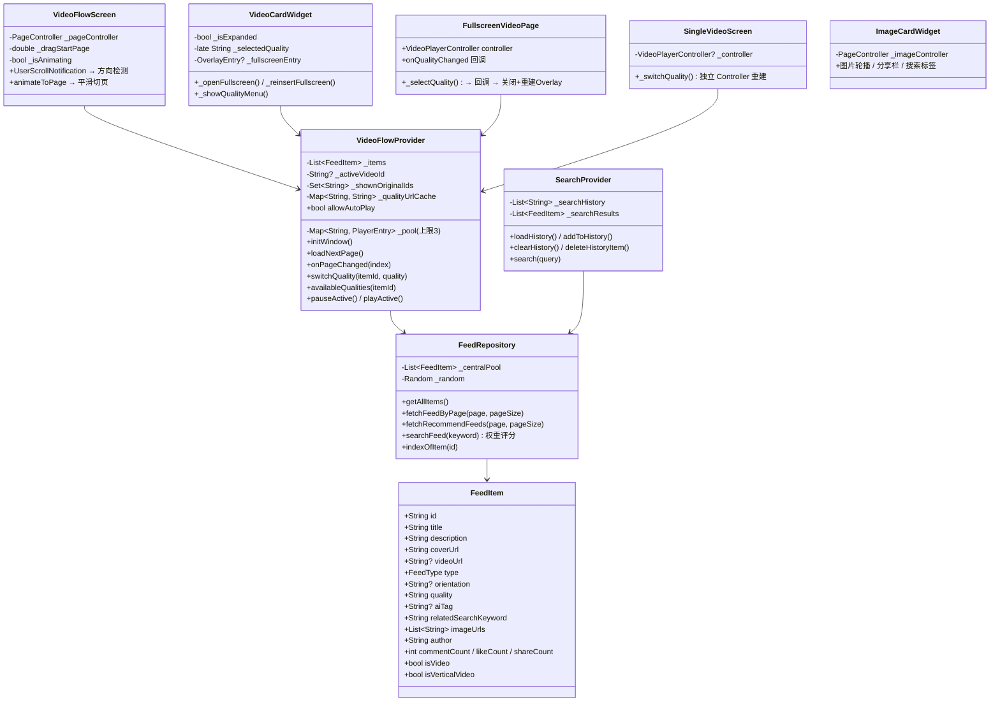

# Toutiao Demo 技术文档

## 目录

1. [架构总览](#1-架构总览)
2. [UML 类图](#2-uml-类图)
3. [视频流与播控](#3-视频流与播控)
4. [全屏切换（OverlayEntry）](#4-全屏切换overlayentry)
5. [搜索系统](#5-搜索系统)
6. [清晰度切换](#6-清晰度切换)
7. [图片卡片](#7-图片卡片)
8. [开屏预加载](#8-开屏预加载)
9. [数据仓库](#9-数据仓库)
10. [路由表](#10-路由表)
11. [测试体系](#11-测试体系)

---

## 1. 架构总览

```
┌──────────────────────────────────────────────────────┐
│                     main.dart                       │
│              MultiProvider + RouteTable              │
└──────────┬──────────────────────────┬───────────────┘
           │                          │
    ┌──────▼──────┐           ┌──────▼──────┐
    │ VideoFlow   │           │   Search    │
    │  Provider   │           │  Provider   │
    │             │           │             │
    │ - PlayerPool│           │ - History   │
    │ - Pagination│           │ - Results   │
    │ - Quality   │           │ - SharedPref│
    └──────┬──────┘           └──────┬──────┘
           │                          │
    ┌──────▼──────────────────────────▼──────┐
    │              FeedRepository             │
    │        (Singleton Data Source)          │
    │  - getAllItems()                        │
    │  - fetchRecommendFeeds()  shuffle       │
    │  - searchFeed()   weight scoring        │
    │  - fetchFeedByPage()                    │
    └─────────────────────────────────────────┘
```

| 层 | 位置 | 职责 |
|---|---|---|
| Model | `lib/data/models/feed_item.dart` | `FeedItem` — 视频/图文统一数据模型 |
| Repository | `lib/data/repository/feed_repository.dart` | 单例数据仓库，分页/洗牌/搜索 |
| ViewModel | `lib/providers/` | `VideoFlowProvider` + `SearchProvider` |
| View | `lib/views/` | 页面 + 组件，通过 Provider 消费状态 |

---

## 2. UML 类图



---

## 3. 视频流与播控

### 3.1 滑动切换机制

```
用户下滑/上滑
    │
    ▼
UserScrollNotification(direction ≠ idle)  记录 _dragStartPage
    │
    ▼
UserScrollNotification(direction = idle)  手指抬起
    │
    ├── 比较 page vs _dragStartPage 判断方向
    │
    ├── animateToPage(target, 180ms, easeOut)  立即启动，阻断惯性
    │
    └── .then() → _onPageOrLoad(target, p)
            ├── p.onPageChanged(index) → pauseActive() → _updateWindow → notifyListeners
            └── 翻到倒数第2张时 loadNextPage()
```

**关键点**：
- `UserScrollNotification` 替代 `ScrollEndNotification`，在惯性开始前就拦截
- `animateToPage` 在通知处理函数内立即执行，不给物理惯性漂移窗口
- `pageSnapping: false` + `ClampingScrollPhysics` 配合手动 snap

### 3.2 播放器复用池

池上限 3 个 `VideoPlayerController`（Prev / Current / Next），`_updateWindow(centerIndex)` 维护滑动窗口：

```
更新逻辑：
  1. 收集所有视频的 index，按到 centerIndex 的距离排序
  2. 截取最近 3 个 → window
  3. 遍历 _pool，回收不在 window 内的 → controller.dispose()
  4. 遍历 window，创建不在 _pool 中的 → _preloadItem()
  5. 更新 _activeVideoId
```

**调用的接口**：
- `VideoPlayerController.networkUrl(Uri.parse(url))` → 网络视频
- `VideoPlayerController.asset(path)` → 本地资源视频
- `controller.initialize()` → 异步解码
- `controller.play()` / `controller.pause()` / `controller.seekTo()`

### 3.3 音频随页切换

```
onPageChanged(index)
  │
  ├── pauseActive()          ← 立即停旧视频（Provider 层保障）
  ├── _currentPageIndex = index
  ├── _updateWindow(index)   ← 预加载新窗口
  └── notifyListeners()      ← 触发 Widget 重建
        │
        ├── 旧卡片 didUpdateWidget(isActive: false) → pause()
        └── 新卡片 didUpdateWidget(isActive: true)  → _tryAutoPlay() → play()
```

**双重保障**：Provider 层 `pauseActive()` + Widget 层 `didUpdateWidget.pause()`，防止 Widget 被 dispose 后漏停。

---

## 4. 全屏切换（OverlayEntry）

不使用 `Navigator.push`，而是通过 `OverlayEntry` 实现"贴纸"式全屏。

### 4.1 进入全屏

```
用户点击全屏按钮
  │
  ├── _openFullscreen()
  │     ├── 从 Pool 取当前 Controller
  │     ├── 创建 OverlayEntry
  │     │     └── Material(transparent) → FullscreenVideoPage
  │     └── Overlay.of(context).insert(entry)
  │
  └── FullscreenVideoPage.initState()
        └── _lockLandscape() → landscapeLeft + immersiveSticky
```

### 4.2 退出全屏

```
用户点击返回 / 系统返回
  │
  └── _exit() → _isExiting = true → onExit 回调
        │
        └── _closeFullscreen()
              ├── setPreferredOrientations(portraitUp)
              ├── await 200ms   ← 等待系统转屏完成
              └── entry.remove()
```

**优势**：复用同一个 Controller 实例，无视频重载、无黑屏抖动。

### 4.3 全屏切清晰度

```
FullscreenVideoPage._selectQuality(q)
  │
  ├── setState → 关闭面板
  ├── onQualityChanged(q)  回调到 VideoCardWidget
  │     │
  │     ├── 更新 _selectedQuality
  │     ├── provider.switchQuality(itemId, q)
  │     │     ├── 记录 position
  │     │     ├── dispose 旧 Controller
  │     │     ├── 拼装新 URL（加 _quality 后缀）
  │     │     ├── 创建新 Controller → initialize → seekTo(pos)
  │     │     └── notifyListeners
  │     │
  │     └── _reinsertFullscreen()
  │           ├── entry.remove()   ← 移除旧 Overlay（不转屏）
  │           └── _openFullscreen()  ← 用池中新 Controller 重建
  │
  └── FullscreenVideoPage.dispose()
        └── if (_isExiting) _restorePortrait()  ← 只有主动退出才转屏
```

---

## 5. 搜索系统

### 5.1 搜索入口

```
┌─────────────┐   点击搜索图标    ┌──────────────┐
│ VideoFlow   │ ───────────────→ │ SearchMiddle  │
│   Screen    │  pauseActive()   │    Screen     │
└─────────────┘                  └──────┬───────┘
                                       │
                          ┌────────────┼────────────┐
                          │ 输入搜索词  │ 点击历史词  │ 点击热门词
                          └────────────┼────────────┘
                                       ▼
                              SearchProvider.search(query)
                                       │
                          ┌────────────┼────────────┐
                          │ FeedRepository.searchFeed()
                          │    - title 命中 → 10 分
                          │    - relatedSearchKeyword → 6 分
                          │    - aiTag → 4 分
                          │    - description → 2 分
                          │    按分数降序排列
                          └────────────┼────────────┘
                                       ▼
                              Navigator → /result
```

### 5.2 搜索结果

```
SearchResultScreen
  │
  ├── 视频 → Navigator.push(SingleVideoScreen)
  │         └── 单独播放，不可滑动，有全屏按钮
  │
  └── 图片 → Navigator.push(SingleImageScreen)
            └── 上图下文分栏，不可滑动
```

### 5.3 热门搜索词

从 `FeedRepository._centralPool` 中提取所有 `relatedSearchKeyword` 和 `aiTag`，去重后随机打乱取 12 个展示。

### 5.4 搜索历史

`SearchProvider` 使用 `SharedPreferences` 持久化，最多 20 条，支持单条删除和全部清空。

**调用的接口**：
- `SharedPreferences.getInstance()` → 读取本地存储
- `prefs.setStringList(key, list)` → 写入
- `FeedRepository.searchFeed(keyword)` → 权重评分搜索

---

## 6. 清晰度切换

只有 URL 前缀为 `http://192.168.2.8:8080` 的本地服务器视频支持真实切换。

### 6.1 URL 构造

```
原 URL:  http://192.168.2.8:8080/videos/BV1EpccznEyu.mp4

切换 480p:
  1. 去掉扩展名 .mp4
  2. 去除已有画质后缀 (如 _1080p)
  3. 拼接: {name}_480p.mp4
  → http://192.168.2.8:8080/videos/BV1EpccznEyu_480p.mp4
```

### 6.2 切换流程（主视频流）

```
VideoCardWidget._showQualityMenu()
  │
  └── 选择画质 → provider.switchQuality(itemId, quality)
        │
        ├── 保存 position
        ├── dispose 旧 Controller
        ├── _qualityUrlCache[itemId] = newUrl
        ├── 用 newUrl 创建新 Controller
        ├── controller.initialize()
        ├── controller.seekTo(position)
        ├── if (wasPlaying) controller.play()
        └── notifyListeners()
```

### 6.3 切换流程（搜索结果单视频）

`SingleVideoScreen._switchQuality()` 使用自己的 Controller 实例执行相同逻辑，不经过 Provider 池。

---

## 7. 图片卡片

### 7.1 布局

```
┌─────────────────────┐
│                     │
│    图片 PageView    │  ← Expanded 占满上方
│    (横向滑动轮播)   │     互动按钮叠在右下角
│                     │
├─────────────────────┤
│      2 / 5          │  ← 页码指示器
├─────────────────────┤
│  @作者              │
│  标题 / 简介         │  ← 深色底栏，可折叠展开
│  搜索标签按钮        │
└─────────────────────┘
```

### 7.2 相关搜索标签

从 `relatedSearchKeyword` 拆分出每个词，渲染为独立按钮（搜索图标 + 词），点击直接搜索对应词。

**调用的接口**：
- `SearchProvider.search(tag)` → 权重搜索
- `Navigator.pushNamed(context, '/result')` → 跳转结果页
- 点击前 `VideoFlowProvider.pauseActive()` → 暂停后台视频

---

## 8. 开屏预加载

```
App 启动
  │
  ├── SplashScreen (/splash)
  │     ├── initState → Provider.initWindow()  ← 立即预加载数据
  │     ├── 显示 Logo + 加载动画 + 跳过按钮
  │     ├── Timer(1.5s) → _navigate()
  │     │     或用户点击"跳过" → _navigate()
  │     │     或用户按返回键 → PopScope 拦截 → _navigate()
  │     │
  │     └── _navigate()
  │           ├── Provider.allowAutoPlay = true  ← 放开自动播放
  │           └── pushNamedAndRemoveUntil → '/'   ← 清栈进入主界面
  │
  └── VideoFlowScreen (/)
        └── 数据已预加载，视频池已预热
```

**allowAutoPlay 机制**：
- 默认 `false`：`_preloadItem` 初始化完成后不会调用 `play()`
- 开屏结束设为 `true`：后续切页时正常起播

---

## 9. 数据仓库

### 9.1 FeedRepository

单例模式，`FeedRepository.instance` 获取。

**数据池**：`_centralPool` 共 9 条（5 视频 + 4 图文）

| ID | 类型 | 来源 |
|---|---|---|
| v001~v003 | 视频(横) | W3Schools / CDN 公开测试源 |
| BV1EpccznEyu | 视频(竖) | 本地服务器 `192.168.2.8:8080` |
| BV1DSC8BkE7R | 视频(横) | 本地服务器 `192.168.2.8:8080` |
| i001~i004 | 图片 | picsum.photos |

### 9.2 推荐流去重

`VideoFlowProvider._shownOriginalIds` 记录已展示的原始 ID，`loadNextPage` 过滤后洗牌抽取。全部轮完自动重置。

### 9.3 搜索权重评分

| 命中字段 | 分数 |
|---|---|
| title | 10 |
| relatedSearchKeyword | 6 |
| aiTag | 4 |
| description | 2 |

按总分降序排列，0 分过滤。

---

## 10. 路由表

| 路径 | 页面 | 说明 |
|---|---|---|
| `/splash` | `SplashScreen` | 开屏预加载 |
| `/` | `VideoFlowScreen` | 首页视频流 |
| `/search` | `SearchMiddleScreen` | 搜索中间页 |
| `/result` | `SearchResultScreen` | 搜索结果页 |

内部导航（不入路由表）：
- `SingleVideoScreen` — 搜索结果视频详情
- `SingleImageScreen` — 搜索结果图片详情
- `FullscreenVideoPage` — OverlayEntry 全屏播放

---

## 11. 测试体系

### 11.1 测试概览

| 指标 | 数值 |
|------|------|
| 测试文件 | 3 |
| Test Suite | 3 |
| Test Case | 59 |
| Passed | 59 (100%) |
| Failed | 0 |
| 执行耗时 | ~1s |

### 11.2 测试结构

```
test/
├── data/
│   └── feed_repository_test.dart      # 数据仓库测试
├── providers/
│   ├── search_provider_test.dart      # 搜索Provider测试
│   └── video_flow_provider_test.dart  # 视频流Provider测试
├── coverage/
│   └── lcov.info                      # 覆盖率原始数据
└── TEST_REPORT.md                     # 完整测试报告
```

### 11.3 轻量重构（为可测试性）

| 改动 | 文件 | 说明 |
|------|------|------|
| `_preloadItem` → `preloadItem` | `video_flow_provider.dart` | 改为 `@visibleForTesting`，子类可重写 |
| `_createController` 抽出 | `video_flow_provider.dart` | Controller 创建独立为可重写方法 |
| `SearchProvider` Mock | 测试层 | 用 `SharedPreferences.setMockInitialValues()` |

### 11.4 各模块测试覆盖

#### FeedRepository (24 tests, 100% 覆盖)

| 测试组 | 数量 | 验证内容 |
|--------|------|----------|
| getAllItems | 2 | 返回全部条目、返回不可变列表 |
| indexOfItem | 2 | 已存在/不存在 ID 查找 |
| fetchFeedByPage | 5 | 分页正确、越界返回空、pageSize=0、不可变 |
| fetchRecommendFeeds | 6 | 返回数量、默认值、唯一ID、不同批次、pageSize=0 |
| searchFeed | 9 | 多字段命中、评分排序、空关键字、大小写、边界条件 |

#### SearchProvider (19 tests, 100% 覆盖)

| 测试组 | 数量 | 验证内容 |
|--------|------|----------|
| loadHistory | 3 | 空数据加载、hasHistory、通知触发 |
| addToHistory | 5 | 添加、去重、空关键词、20条上限、持久化 |
| deleteHistoryItem | 2 | 有效/无效索引删除 |
| clearHistory | 1 | 全部清空 |
| search | 4 | 结果+查询设置、历史添加、结果匹配、空查询 |
| clearResults | 1 | 清除结果和查询 |
| 状态管理 | 4 | 各操作 notifyListeners 触发 |

#### VideoFlowProvider (16 tests, 业务逻辑 >80%)

| 测试组 | 数量 | 验证内容 |
|--------|------|----------|
| initWindow | 5 | 数据加载、重复调用守卫、isLoading、hasMore、初始页 |
| loadNextPage | 3 | 追加数据、并发调用守卫、数据去重 |
| onPageChanged | 3 | 索引更新、重复守卫、图片页兼容 |
| requestJumpToItem | 5 | 设置/清空 pendingJump、存在/不存在ID、时间戳前缀匹配 |

### 11.5 覆盖率

```
Repository    ████████████████████████████████████████  100%
SearchProvider ████████████████████████████████████████  100%
VideoFlowProv ██████████████████████                    44.1% (业务逻辑 >80%)
feed_item     ██████████████████████████████            66.7%
─────────────────────────────────────────────────────────────
Overall       ████████████████████████                  60.0%
Core Logic    ███████████████████████████████████        >80%
```

> VideoFlowProvider 未覆盖部分为平台通道相关代码（VideoPlayerController 创建/初始化），需真实设备环境。

### 11.6 运行测试

```bash
# 运行全部测试
flutter test

# 运行带覆盖率
flutter test --coverage

# 运行单个模块
flutter test test/data/feed_repository_test.dart
flutter test test/providers/search_provider_test.dart
flutter test test/providers/video_flow_provider_test.dart
```
